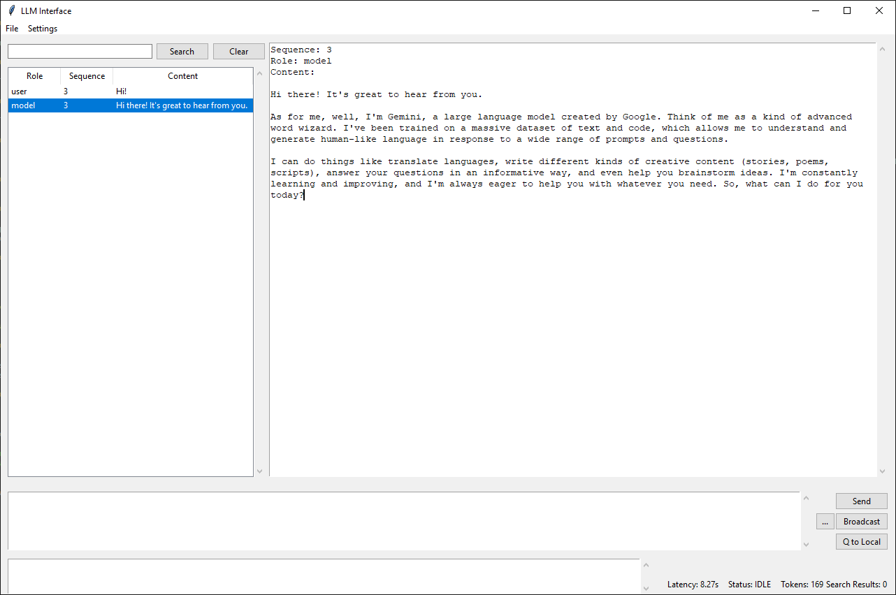

# What is this?

This tool is a Python Tk interface to Gemini. Because AI Studio gets too clunky when the context gets big. This is my primary tool that I use in my research work and thought others may benefit from it. The tool also supports Llama on Groq. You can easily add other LLMs as well, of course.

# UI screenshot



# INSTALL

Make sure Python tkinter is available, as appropriate depending on your OS and your local Python setup.

```sh
# set credentials as needed (create .env file)
# (if desired) copy + edit user_ui_model.py to user_ui_model_local.py
# (if desired) create .txt files for your Prompt Stack
$ uv run gemini_llm_tkui.py
```

# Configure your keys

Create `.env` file with:

```sh
# A) For Gemini on Google AI
# Do not set this if you want Vertex AI
GOOGLE_API_KEY=<...>

# B) For Vertex AI
GOOGLE_APPLICATION_CREDENTIALS=<...>.json
GOOGLE_VERTEX_AI_PROJECT_ID=<...>
GOOGLE_VERTEX_AI_REGION=us-central1

# C) For Llama on Groq
GROQ_API_KEY=<...>
```

# What can you do?

- Run LLM queries, obviously...
- Have multiple instances of the tool running (e.g. different models) and have messages cross-post more easily
  -- Make sure to install pyzmq
  -- Make sure to run the ZeroMQ broker script (`gemini_llm_zmq_router.py`)
  -- Play with the Broadcast + Q to Local buttons
  -- This feature will probably morph and evolve over time

- Load & save context from the tool itself
- Load context from "<> Get Code" button in Google AI Studio
  -- Language drop-down needs to be Python
  -- NB: only works with text, will fail with file attachments

- Use different configurations with different generation settings and system instructions
- Tweak generation settings from the menus and extend easily

# What features are missing?

- Citations
- File attachments have had very limited testing so far
  * `audio/mp3` works, I haven't tested anything else but should be as simple as mapping the `mime_type`
  * load/save works and de/serializes the blobs

I have no plans to currently implement these, but PRs are very welcome!
